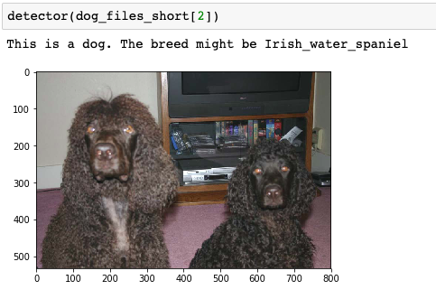

# Dog Breeds Classifier

## Motivation

The purpose of this project is to use a convolutional neural network (CNN) to predict dog breeds. The main object is to evaluate an image then a prediction of which dog breed the dog is, or which dog breed the human most resembles. If the image is detected as neither a dog nor a human, the classifier will not run.

## File Descriptions 
- dog_app.ipynb is a Jupyter notebook, contains the whole project code to create a dog breed classifier.
- The images folder includes all images used for this project.
- The saved_models folder contains the models saved during this project

## Achievements 

During the test phase the model achieve the accuracy: 82.1770%

### Model

### Model Accuracy

### Model Loss

## Results 

To check the results I have used:

#### 3 Images from Humans

#### 6 Images from Dogs

## Required Libraries 

- Pandas, NumPy, Scikit-learn, tqdm
- Matplotlib, ImageFile
- Keras, cv2
- Glob library 

## Acknowledgements 

The below links, were very useful for completing the projects,
- https://keras.io